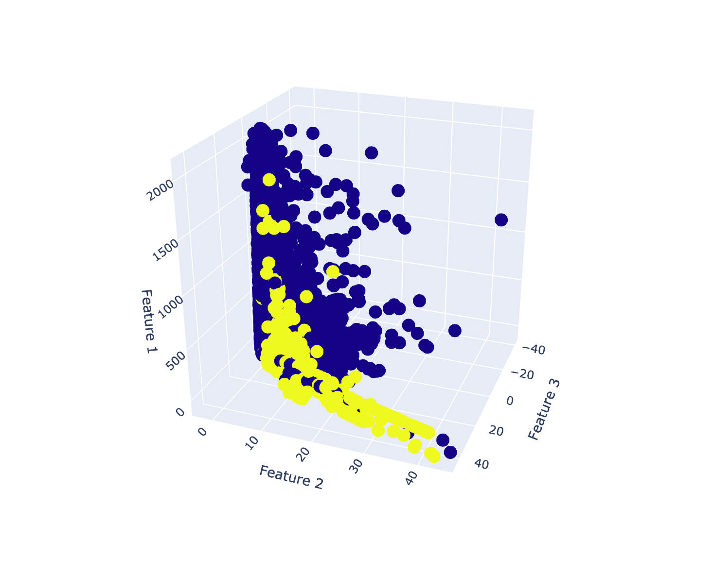

# Credit Card Fraud Detection

This notebook illustrates techniques and machine learning algorithms for detecting fradulent credit card transactions.
Common issue with this types of problems is class imbalance. We combat this issue with over and udersampling techniques. Modeling is done with `Logistic Regression` and `Random Forest` classifiers. Let's get started.


## What is dataset look like?

- The dataset contains transactions made by credit cards in September 2013 by European cardholders. This dataset presents transactions that occurred in two days, where we have 492 frauds out of 284,807 transactions. The dataset is highly unbalanced, the positive class (frauds) account for 0.172% of all transactions.

- It contains only numerical input variables which are the result of a **PCA** transformation. Unfortunately, due to confidentiality issues, we cannot provide the original features and more background information about the data. Features _**V1, V2, … V28**_ are the principal components obtained with **PCA**, the only features which have not been transformed with PCA are 'Time' and 'Amount'. Feature 'Time' contains the seconds elapsed between each transaction and the first transaction in the dataset. The feature 'Amount' is the transaction Amount, this feature can be used for example-dependant cost-sensitive learning. Feature 'Class' is the response variable and it takes value 1 in case of fraud and 0 otherwise.

- Given the class imbalance ratio, we recommend measuring the accuracy using the **Area Under the Precision-Recall Curve (AUPRC)**. Confusion matrix accuracy is not meaningful for unbalanced classification.

- Data is taken from **kaggle.com**: https://www.kaggle.com/mlg-ulb/creditcardfraud

## TL;DR

| Dataset | Model | Tuned | Precision | Recall | F1 | AUC |
| --- | --- | --- | --- | --- | --- | --- |
| Upsampling | Random Forest | No | 0.86 | 0.77 | **0.81** | 97% |
| Imbalanced | Logistic Regression | Yes | 0.54 | 0.82 | 0.65 | 97% |
| Downsampling | Logistic Regression | No | 0.05 | 0.82 | 0.10 | 93% |
| Upsampling | Logistic Regression | No | 0.01 | 0.94 | 0.02 | 97% |
| Downsampling | Random Forest | No | 0.00 | 1.00 | 0.00 | 97% |

## <span id="toc">Table of Contents</span>

1. <a href="#eda">Exploratory Data Analysis</a>
    - <a href="#eda_1">1.1 Target Variable Imbalance</a>
    - <a href="#eda_2">1.2 Checking for Outliers</a>
    - <a href="#eda_3">1.3 Correlations</a>    
    - <a href="#eda_4">1.4 Features Visualization (2D) with Matplotlib</a>
    - <a href="#eda_5">1.5 Features Visualization (3D) with Plotly</a>
2. <a href="#preprocessing">Preprocessing</a>
    - <a href="#preprocessing_1">2.1 Train-Test Split</a>
    - <a href="#preprocessing_2">2.2 Scaling</a>
    - <a href="#preprocessing_3">2.3 Class Imbalance (downsampling)</a>
    - <a href="#preprocessing_4">2.4 Class Imbalance (upsampling)</a>
3. <a href="#modeling">Modeling</a>
    - <a href="#modeling_1">3.1 Isolation Forest</a>
    - <a href="#modeling_2">3.2 Hyper Parameters Tuning for Logistic Regression (Imbalanced Data)</a>
    - <a href="#modeling_3">3.3 Logistic Regression with Optimal Parameters (Imbalanced Data)</a>
    - <a href="#modeling_4">3.4 Logistic Regression on Balanced Data (Downsampling)</a>
    - <a href="#modeling_5">3.5 Logistic Regression on Balanced Data (Upsampling)</a>
    - <a href="#modeling_6">3.6 Random Forest on Balanced Data (Downsampling)</a>
    - <a href="#modeling_7">3.7 Random Forest on Balanced Data (Upsampling)</a>
4. <a href="#conclusion">Conclusion</a>

## Importing Libraries


```python
# Data manipulation, visualization
import pandas as pd
import matplotlib.pyplot as plt
import plotly.express as px
import numpy as np
import seaborn as sns
from time import time

# Models
from sklearn.linear_model import LogisticRegression
from sklearn.neighbors import NearestNeighbors
from sklearn.ensemble import RandomForestClassifier
from sklearn.ensemble import AdaBoostClassifier
from sklearn.ensemble import IsolationForest
from sklearn.ensemble import GradientBoostingClassifier
from sklearn.cluster import KMeans
from sklearn.svm import SVC
import xgboost as xgb

# Preprocessing, dimensionality reduction
from sklearn.preprocessing import StandardScaler
from sklearn.preprocessing import MinMaxScaler
from sklearn.decomposition import PCA
from imblearn.over_sampling import SMOTE
from imblearn.under_sampling import NearMiss
#from sklearn.decomposition import SparsePCA
#from sklearn.decomposition import TruncatedSVD
#from sklearn.manifold import TSNE
#from sklearn.pipeline import make_pipeline

# Evaluation
from sklearn.model_selection import train_test_split
from sklearn.model_selection import cross_val_score
from sklearn.model_selection import GridSearchCV
from sklearn.metrics import classification_report
from sklearn.metrics import f1_score
from sklearn.metrics import confusion_matrix
from sklearn.metrics import plot_roc_curve

import warnings
warnings.filterwarnings('ignore')
```


```python
def evaluation(model, X_train, y_train, X_test, y_test, y_pred) -> None:
    print(classification_report(y_test, y_pred))
    print('-' * 80)
    recall_cv = cross_val_score(model, X_test, y_test, cv=5, scoring='recall')
    print(f'Cross-Validation Score (Recall): {recall_cv.mean()}')
    print('-' * 80)
    plt.rcParams['figure.dpi'] = 72
    sns.heatmap(confusion_matrix(y_test, y_pred), annot=True, fmt='g')
    plt.show()
    print('-' * 80)
    logreg_auc = plot_roc_curve(model, X_test, y_test)
    plt.show()
```

## Loading Data


```python
df = pd.read_csv('creditcard.csv')
```


```python
print(f'Dataset size: {len(df)}')
print(f'Features: {df.shape[1]}')
```

    Dataset size: 284807
    Features: 31


### Quick Glimpse at the Data


```python
df.head()
```


<div>
<style scoped>
    .dataframe tbody tr th:only-of-type {
        vertical-align: middle;
    }

    .dataframe tbody tr th {
        vertical-align: top;
    }

    .dataframe thead th {
        text-align: right;
    }
</style>
<table border="1" class="dataframe">
  <thead>
    <tr style="text-align: right;">
      <th></th>
      <th>Time</th>
      <th>V1</th>
      <th>V2</th>
      <th>V3</th>
      <th>V4</th>
      <th>V5</th>
      <th>V6</th>
      <th>V7</th>
      <th>V8</th>
      <th>V9</th>
      <th>...</th>
      <th>V21</th>
      <th>V22</th>
      <th>V23</th>
      <th>V24</th>
      <th>V25</th>
      <th>V26</th>
      <th>V27</th>
      <th>V28</th>
      <th>Amount</th>
      <th>Class</th>
    </tr>
  </thead>
  <tbody>
    <tr>
      <th>0</th>
      <td>0.0</td>
      <td>-1.359807</td>
      <td>-0.072781</td>
      <td>2.536347</td>
      <td>1.378155</td>
      <td>-0.338321</td>
      <td>0.462388</td>
      <td>0.239599</td>
      <td>0.098698</td>
      <td>0.363787</td>
      <td>...</td>
      <td>-0.018307</td>
      <td>0.277838</td>
      <td>-0.110474</td>
      <td>0.066928</td>
      <td>0.128539</td>
      <td>-0.189115</td>
      <td>0.133558</td>
      <td>-0.021053</td>
      <td>149.62</td>
      <td>0</td>
    </tr>
    <tr>
      <th>1</th>
      <td>0.0</td>
      <td>1.191857</td>
      <td>0.266151</td>
      <td>0.166480</td>
      <td>0.448154</td>
      <td>0.060018</td>
      <td>-0.082361</td>
      <td>-0.078803</td>
      <td>0.085102</td>
      <td>-0.255425</td>
      <td>...</td>
      <td>-0.225775</td>
      <td>-0.638672</td>
      <td>0.101288</td>
      <td>-0.339846</td>
      <td>0.167170</td>
      <td>0.125895</td>
      <td>-0.008983</td>
      <td>0.014724</td>
      <td>2.69</td>
      <td>0</td>
    </tr>
    <tr>
      <th>2</th>
      <td>1.0</td>
      <td>-1.358354</td>
      <td>-1.340163</td>
      <td>1.773209</td>
      <td>0.379780</td>
      <td>-0.503198</td>
      <td>1.800499</td>
      <td>0.791461</td>
      <td>0.247676</td>
      <td>-1.514654</td>
      <td>...</td>
      <td>0.247998</td>
      <td>0.771679</td>
      <td>0.909412</td>
      <td>-0.689281</td>
      <td>-0.327642</td>
      <td>-0.139097</td>
      <td>-0.055353</td>
      <td>-0.059752</td>
      <td>378.66</td>
      <td>0</td>
    </tr>
    <tr>
      <th>3</th>
      <td>1.0</td>
      <td>-0.966272</td>
      <td>-0.185226</td>
      <td>1.792993</td>
      <td>-0.863291</td>
      <td>-0.010309</td>
      <td>1.247203</td>
      <td>0.237609</td>
      <td>0.377436</td>
      <td>-1.387024</td>
      <td>...</td>
      <td>-0.108300</td>
      <td>0.005274</td>
      <td>-0.190321</td>
      <td>-1.175575</td>
      <td>0.647376</td>
      <td>-0.221929</td>
      <td>0.062723</td>
      <td>0.061458</td>
      <td>123.50</td>
      <td>0</td>
    </tr>
    <tr>
      <th>4</th>
      <td>2.0</td>
      <td>-1.158233</td>
      <td>0.877737</td>
      <td>1.548718</td>
      <td>0.403034</td>
      <td>-0.407193</td>
      <td>0.095921</td>
      <td>0.592941</td>
      <td>-0.270533</td>
      <td>0.817739</td>
      <td>...</td>
      <td>-0.009431</td>
      <td>0.798278</td>
      <td>-0.137458</td>
      <td>0.141267</td>
      <td>-0.206010</td>
      <td>0.502292</td>
      <td>0.219422</td>
      <td>0.215153</td>
      <td>69.99</td>
      <td>0</td>
    </tr>
  </tbody>
</table>
<p>5 rows × 31 columns</p>
</div>


### Checking for NULL

Dataset has no null values


```python
df.isna().sum().sum()
```


    0


### Describe

Looking at the data we can tell that `Amount` and `Time` are not scaled and most of the feauters have outliers


```python
df.describe()
```


<div>
<style scoped>
    .dataframe tbody tr th:only-of-type {
        vertical-align: middle;
    }

    .dataframe tbody tr th {
        vertical-align: top;
    }

    .dataframe thead th {
        text-align: right;
    }
</style>
<table border="1" class="dataframe">
  <thead>
    <tr style="text-align: right;">
      <th></th>
      <th>Time</th>
      <th>V1</th>
      <th>V2</th>
      <th>V3</th>
      <th>V4</th>
      <th>V5</th>
      <th>V6</th>
      <th>V7</th>
      <th>V8</th>
      <th>V9</th>
      <th>...</th>
      <th>V21</th>
      <th>V22</th>
      <th>V23</th>
      <th>V24</th>
      <th>V25</th>
      <th>V26</th>
      <th>V27</th>
      <th>V28</th>
      <th>Amount</th>
      <th>Class</th>
    </tr>
  </thead>
  <tbody>
    <tr>
      <th>count</th>
      <td>284807.000000</td>
      <td>2.848070e+05</td>
      <td>2.848070e+05</td>
      <td>2.848070e+05</td>
      <td>2.848070e+05</td>
      <td>2.848070e+05</td>
      <td>2.848070e+05</td>
      <td>2.848070e+05</td>
      <td>2.848070e+05</td>
      <td>2.848070e+05</td>
      <td>...</td>
      <td>2.848070e+05</td>
      <td>2.848070e+05</td>
      <td>2.848070e+05</td>
      <td>2.848070e+05</td>
      <td>2.848070e+05</td>
      <td>2.848070e+05</td>
      <td>2.848070e+05</td>
      <td>2.848070e+05</td>
      <td>284807.000000</td>
      <td>284807.000000</td>
    </tr>
    <tr>
      <th>mean</th>
      <td>94813.859575</td>
      <td>1.168375e-15</td>
      <td>3.416908e-16</td>
      <td>-1.379537e-15</td>
      <td>2.074095e-15</td>
      <td>9.604066e-16</td>
      <td>1.487313e-15</td>
      <td>-5.556467e-16</td>
      <td>1.213481e-16</td>
      <td>-2.406331e-15</td>
      <td>...</td>
      <td>1.654067e-16</td>
      <td>-3.568593e-16</td>
      <td>2.578648e-16</td>
      <td>4.473266e-15</td>
      <td>5.340915e-16</td>
      <td>1.683437e-15</td>
      <td>-3.660091e-16</td>
      <td>-1.227390e-16</td>
      <td>88.349619</td>
      <td>0.001727</td>
    </tr>
    <tr>
      <th>std</th>
      <td>47488.145955</td>
      <td>1.958696e+00</td>
      <td>1.651309e+00</td>
      <td>1.516255e+00</td>
      <td>1.415869e+00</td>
      <td>1.380247e+00</td>
      <td>1.332271e+00</td>
      <td>1.237094e+00</td>
      <td>1.194353e+00</td>
      <td>1.098632e+00</td>
      <td>...</td>
      <td>7.345240e-01</td>
      <td>7.257016e-01</td>
      <td>6.244603e-01</td>
      <td>6.056471e-01</td>
      <td>5.212781e-01</td>
      <td>4.822270e-01</td>
      <td>4.036325e-01</td>
      <td>3.300833e-01</td>
      <td>250.120109</td>
      <td>0.041527</td>
    </tr>
    <tr>
      <th>min</th>
      <td>0.000000</td>
      <td>-5.640751e+01</td>
      <td>-7.271573e+01</td>
      <td>-4.832559e+01</td>
      <td>-5.683171e+00</td>
      <td>-1.137433e+02</td>
      <td>-2.616051e+01</td>
      <td>-4.355724e+01</td>
      <td>-7.321672e+01</td>
      <td>-1.343407e+01</td>
      <td>...</td>
      <td>-3.483038e+01</td>
      <td>-1.093314e+01</td>
      <td>-4.480774e+01</td>
      <td>-2.836627e+00</td>
      <td>-1.029540e+01</td>
      <td>-2.604551e+00</td>
      <td>-2.256568e+01</td>
      <td>-1.543008e+01</td>
      <td>0.000000</td>
      <td>0.000000</td>
    </tr>
    <tr>
      <th>25%</th>
      <td>54201.500000</td>
      <td>-9.203734e-01</td>
      <td>-5.985499e-01</td>
      <td>-8.903648e-01</td>
      <td>-8.486401e-01</td>
      <td>-6.915971e-01</td>
      <td>-7.682956e-01</td>
      <td>-5.540759e-01</td>
      <td>-2.086297e-01</td>
      <td>-6.430976e-01</td>
      <td>...</td>
      <td>-2.283949e-01</td>
      <td>-5.423504e-01</td>
      <td>-1.618463e-01</td>
      <td>-3.545861e-01</td>
      <td>-3.171451e-01</td>
      <td>-3.269839e-01</td>
      <td>-7.083953e-02</td>
      <td>-5.295979e-02</td>
      <td>5.600000</td>
      <td>0.000000</td>
    </tr>
    <tr>
      <th>50%</th>
      <td>84692.000000</td>
      <td>1.810880e-02</td>
      <td>6.548556e-02</td>
      <td>1.798463e-01</td>
      <td>-1.984653e-02</td>
      <td>-5.433583e-02</td>
      <td>-2.741871e-01</td>
      <td>4.010308e-02</td>
      <td>2.235804e-02</td>
      <td>-5.142873e-02</td>
      <td>...</td>
      <td>-2.945017e-02</td>
      <td>6.781943e-03</td>
      <td>-1.119293e-02</td>
      <td>4.097606e-02</td>
      <td>1.659350e-02</td>
      <td>-5.213911e-02</td>
      <td>1.342146e-03</td>
      <td>1.124383e-02</td>
      <td>22.000000</td>
      <td>0.000000</td>
    </tr>
    <tr>
      <th>75%</th>
      <td>139320.500000</td>
      <td>1.315642e+00</td>
      <td>8.037239e-01</td>
      <td>1.027196e+00</td>
      <td>7.433413e-01</td>
      <td>6.119264e-01</td>
      <td>3.985649e-01</td>
      <td>5.704361e-01</td>
      <td>3.273459e-01</td>
      <td>5.971390e-01</td>
      <td>...</td>
      <td>1.863772e-01</td>
      <td>5.285536e-01</td>
      <td>1.476421e-01</td>
      <td>4.395266e-01</td>
      <td>3.507156e-01</td>
      <td>2.409522e-01</td>
      <td>9.104512e-02</td>
      <td>7.827995e-02</td>
      <td>77.165000</td>
      <td>0.000000</td>
    </tr>
    <tr>
      <th>max</th>
      <td>172792.000000</td>
      <td>2.454930e+00</td>
      <td>2.205773e+01</td>
      <td>9.382558e+00</td>
      <td>1.687534e+01</td>
      <td>3.480167e+01</td>
      <td>7.330163e+01</td>
      <td>1.205895e+02</td>
      <td>2.000721e+01</td>
      <td>1.559499e+01</td>
      <td>...</td>
      <td>2.720284e+01</td>
      <td>1.050309e+01</td>
      <td>2.252841e+01</td>
      <td>4.584549e+00</td>
      <td>7.519589e+00</td>
      <td>3.517346e+00</td>
      <td>3.161220e+01</td>
      <td>3.384781e+01</td>
      <td>25691.160000</td>
      <td>1.000000</td>
    </tr>
  </tbody>
</table>
<p>8 rows × 31 columns</p>
</div>


## <span id="eda">1. EDA</span>&nbsp;&nbsp;<a href="#toc" title="Back to the table of contents">up</a>

### <span id="eda_1">1.1 Target Variable Imbalance</span>

Target Variable(Class) is extremely imbalanced because most of the transactions are non fraudulent (`class 0`). 

This presents two problems:
1. Model will have trouble to learn fradulent transactions because there is little data
2. Evaluation of the model cannot be done with simple accuracy because even if the model wouldn't be able to correcly identify fradulent transactions at all it still will be correct **99.998%** of times

To solve this problem we most likely will be using over/undersampling technique which comes with `imblearn` package.


```python
plt.style.use('seaborn-whitegrid')
plt.rcParams['figure.dpi'] = 70
plt.bar(
    df.Class.value_counts().keys(),
    df.Class.value_counts().values,
    tick_label = [0, 1]
)
plt.title('Target Variable', fontsize=16)
plt.xlabel('Classes', fontsize=13)
plt.ylabel('Records', fontsize=13)
plt.show()
```


    

    


### <span id="eda_2">1.2 Checking for Outliers</span>


```python
print(f'Maximum amount for normal transaction: {df[df.Class==0]["Amount"].max():>14}')
print(f'Maximum amount for fraudulent transaction: {df[df.Class==1]["Amount"].max():>10}')
```

    Maximum amount for normal transaction:       25691.16
    Maximum amount for fraudulent transaction:    2125.87


Average transaction amount is **88**, but  some of the transactions go up to 25000. In fact, ~99.8% of all the transaction are in 2200 range. With that being said it would make sense to cut outliers out of data set, but we still will keep all the fraudulent transactions in place.


```python
print(f'Original dataset size: {len(df)}')
df = df[df.Amount <= 2200]
print(f'After removing outliers: {len(df)}')
```

    Original dataset size: 284807
    After removing outliers: 284239


We can observe that `Amount` still contains some outliers, but I decided to keep these data points anyway


```python
plt.boxplot(df.Amount)
plt.show()
```


    

    


Amounts are similar for both normal and fraudulent transactions


```python
plt.figure(figsize=(16,5))
plt.hist(df[df.Class==0].Amount, bins=70, density=True, label='Normal')
plt.hist(df[df.Class==1].Amount, bins=70, density=True, alpha=0.7, label='Fraudulent')
plt.title('Amounts', fontsize=16)
plt.xticks([i for i in range(0, 2500, 250)])
plt.legend()
plt.show()
```


    

    


### Outliers for V1-V28 Features

Features `V1 - V28` are scaled to some degree. We can observe that these features have outliers on both ends


```python
plt.rcParams['figure.dpi'] = 220
fig, axs = plt.subplots(7, 4, figsize=(15,15))
fig.suptitle('Checking for Outliers')
fig.tight_layout()

v = 1
for i in range(7):
    for j in range(4):
        axs[i, j].set_title(f'V{v}')
        axs[i, j].boxplot(df[f'V{v}'])
        v += 1
```


    

    


### <span id="eda_3">1.3 Correlations</span>


```python
plt.figure(figsize=(16,10))
sns.set(font_scale=1.2)
sns.heatmap(df.corr(), linewidths=0.01, linecolor='#6b1e5b')
plt.show()
```


    

    


### <span id="eda_4">1.4 Features Visualization (2D) with Matplotlib</span>

We are going to use Principal Component Analysis to select 2 features with maximum variance


```python
pca = PCA(2)
pca_features = pca.fit_transform(X=df.drop(['Time','Class'], axis=1), y=df.Class)
```


```python
pca_2d = pd.DataFrame(pca_features, columns=['Feature 1', 'Feature 2'])
pca_2d['Class'] = df.Class
```


```python
plt.rcParams['figure.dpi'] = 227
plt.style.use('seaborn-whitegrid')
plt.figure(figsize=(14,5))
plt.scatter(pca_2d[pca_2d.Class==0]['Feature 1'], pca_2d[pca_2d.Class==0]['Feature 2'])
plt.scatter(pca_2d[pca_2d.Class==1]['Feature 1'], pca_2d[pca_2d.Class==1]['Feature 2'], alpha=0.6)
plt.legend(['Non Fraudulent', 'Fraudulent'])
plt.show()
```


    

    


### <span id="eda_5">1.5 Features Visualization (3D) with Plotly</span>


```python
df_sample = df[df.Class == 0].sample(150000)
df_sample = df_sample.append(df[df.Class == 1])
```


```python
pca = PCA(3)
pca_features = pca.fit_transform(X = df_sample.drop(['Time','Class'], axis=1), y = df.Class)
```


```python
pca_df = pd.DataFrame(pca_features, columns=['Feature 1', 'Feature 2', 'Feature 3'])
pca_df['Target'] = df_sample.Class.to_numpy()
```


```python
fig = px.scatter_3d(
    pca_df, 
    x='Feature 3', 
    y='Feature 2', 
    z='Feature 1',
    color='Target',
    width=1000,
    height=1000,
    opacity=1
)
fig.show()
```



## <span id="preprocessing">2. Preprocessing</span>&nbsp;&nbsp;<a href="#toc" title="Back to the table of contents">up</a>


```python
X = df.drop(['Class'], axis=1)
y = df.Class
```

### <span id="preprocessing_1">2.1 Train-Test Split</span>

Before we decide how to work with class imbalance, we should split data into train and test parts to **avoid data leakage**


```python
X_train, \
X_test, \
y_train, \
y_test = train_test_split(X, y, train_size=0.75)
```

### <span id="preprocessing_2">2.2 Scaling</span>

Scaling is important for some of the ML algorithms as it will reduce learning time and overall model performance. Tree-based models do not require any kind of normalization and will perform the same.


```python
scaling = MinMaxScaler()
X_train = scaling.fit_transform(X_train)
X_test = scaling.transform(X_test)
```

### <span id="preprocessing_3">2.3 Class Imbalance (downsampling)</span>

We are going to try both down and upsampling and see which technique produces better results. Here downsampling technique is appied to `Train` part of the dataset. Result of this procedure is equally distributed positive and negative class.


```python
downsample = NearMiss(n_jobs=-1)
```


```python
X_train_down, y_train_down = downsample.fit_resample(X_train, y_train)
```


```python
# y_train_down now has equal amounts of observations for each class
y_train_down.value_counts()
```


    0    352
    1    352
    Name: Class, dtype: int64


```python
# Test set contains data that model has no access to
y_test.value_counts()
```


    0    70920
    1      140
    Name: Class, dtype: int64


### <span id="preprocessing_4">2.4 Class Imbalance (upsampling)</span>

Common technique is to use upsampling with `SMOTE` (Synthetic Minority Oversampling Technique), which produces equal amount of observation for both class by generating synthetic samples for minority class, in our case it is `Class 1`


```python
upsample = SMOTE(n_jobs=-1)
```


```python
X_train_up, y_train_up = upsample.fit_resample(X_train, y_train)
```


```python
# y_train_down now has equal amounts of observations for each class
y_train_up.value_counts()
```


    0    212827
    1    212827
    Name: Class, dtype: int64


```python
# Test set contains data that model has no access to
y_test.value_counts()
```


    0    70920
    1      140
    Name: Class, dtype: int64


## <span id="modeling">3. Modeling</span>&nbsp;&nbsp;<a href="#toc" title="Back to the table of contents">up</a>

Modeling part is all about trying different models, hyperparameters tuning, validation

### 3.1 <span id="modeling_1">Isolation Forest</span>

Isolation forest is the type of the tree based model that is used for identifying outliers. Without going into details of inner workings, we can fit the model on the `Class 0` only, then predict on the `Class 1` and observe how many positive (fraudulent) observations were labelled as outliers. Result will give an idea what result we can expect when applying models such as Logistic Regression and such.


```python
clf = IsolationForest(n_estimators=100)
clf.fit(df[df.Class==0])
y_pred_outliers = clf.predict(df[df.Class==1])
sum(y_pred_outliers == -1) / len(y_pred_outliers)
```


    0.8252032520325203


82.5% observations were correctly identified as outliers, which means 16.3% of the fraudulent transactions blend in with normal transactions.

### 3.2 <span id="modeling_2">Hyper Parameters Tuning for Logistic Regression (Imbalanced Data)</span>

First I want to find the best parameters for the logistic regression model on the original, imbalanced data. Logistic regression has `class_weight` parameter, which will help to overcome class imbalance by putting more attention to the minority class.


```python
parameters = {
    'C': (0.01, 0.5, 1), 
    'class_weight': [{0: w1, 1: w2} for w1 in (0.05, 0.1) for w2 in (2.5, 3, 3.5, 4)]
}

logreg = LogisticRegression()
logreg_gridsearch = GridSearchCV(logreg, param_grid=parameters, scoring='recall', n_jobs=-1, cv=5)
logreg_gridsearch.fit(X_train, y_train)

logreg_gridsearch.best_estimator_
```


    LogisticRegression(C=1, class_weight={0: 0.05, 1: 4})


```python
# We won't need these anymore
try:
    del parameters, logreg, logreg_gridsearch
except:
    print('Parameters already got deleted')
```

### <span id="modeling_3">3.3 Logistic Regression with Optimal Parameters (Imbalanced Data)</span>

It makes no difference if I use `logreg_gridsearch` or start new model with the best parameters. For my own convenience I want to start with a clean slate and fit brand new model with optimal hyperparameters


```python
logreg = LogisticRegression(C=1, class_weight={0: 0.05, 1: 4})
```


```python
logreg.fit(X_train, y_train)
```


    LogisticRegression(C=1, class_weight={0: 0.05, 1: 4})


```python
y_pred = logreg.predict(X_test)
```


```python
evaluation(logreg, X_train, y_train, X_test, y_test, y_pred)
```

                  precision    recall  f1-score   support
    
               0       1.00      1.00      1.00     70934
               1       0.54      0.82      0.65       126
    
        accuracy                           1.00     71060
       macro avg       0.77      0.91      0.82     71060
    weighted avg       1.00      1.00      1.00     71060
    
    --------------------------------------------------------------------------------
    Cross-Validation Score (Recall): 0.7449230769230769
    --------------------------------------------------------------------------------


    

    


    --------------------------------------------------------------------------------


    

    


```python
'''
false_negative = pd.DataFrame(y_test)
false_negative['Prediction'] = y_pred
fn_index = false_negative[(false_negative['Class'] == 1) & (false_negative['Prediction'] == 0)].index
tp_index = false_negative[(false_negative['Class'] == 1) & (false_negative['Prediction'] == 1)].index
scaling.inverse_transform(df.loc[tp_index].Amount.to_numpy().reshape(-1, 1)).mean()
scaling.inverse_transform(df.loc[fn_index].Amount.to_numpy().reshape(-1, 1)).mean()
'''
```


    "\nfalse_negative = pd.DataFrame(y_test)\nfalse_negative['Prediction'] = y_pred\nfn_index = false_negative[(false_negative['Class'] == 1) & (false_negative['Prediction'] == 0)].index\ntp_index = false_negative[(false_negative['Class'] == 1) & (false_negative['Prediction'] == 1)].index\nscaling.inverse_transform(df.loc[tp_index].Amount.to_numpy().reshape(-1, 1)).mean()\nscaling.inverse_transform(df.loc[fn_index].Amount.to_numpy().reshape(-1, 1)).mean()\n"


### <span id="modeling_4">3.4 Logistic Regression on Balanced Data (Downsampling)</span>


```python
logreg = LogisticRegression()
logreg.fit(X_train_down, y_train_down)
y_pred = logreg.predict(X_test)
evaluation(logreg, X_train, y_train, X_test, y_test, y_pred)
```

                  precision    recall  f1-score   support
    
               0       1.00      0.97      0.99     70934
               1       0.05      0.82      0.10       126
    
        accuracy                           0.97     71060
       macro avg       0.53      0.90      0.54     71060
    weighted avg       1.00      0.97      0.98     71060
    
    --------------------------------------------------------------------------------
    Cross-Validation Score (Recall): 0.42030769230769227
    --------------------------------------------------------------------------------


    

    


    --------------------------------------------------------------------------------


    

    


### <span id="modeling_5">3.5 Logistic Regression on Balanced Data (Upsampling)</span>


```python
logreg = LogisticRegression(C=1)
logreg.fit(X_train_up, y_train_up)
y_pred = logreg.predict(X_test)
evaluation(logreg, X_train, y_train, X_test, y_test, y_pred)
```

                  precision    recall  f1-score   support
    
               0       1.00      0.81      0.89     70934
               1       0.01      0.94      0.02       126
    
        accuracy                           0.81     71060
       macro avg       0.50      0.88      0.46     71060
    weighted avg       1.00      0.81      0.89     71060
    
    --------------------------------------------------------------------------------
    Cross-Validation Score (Recall): 0.42030769230769227
    --------------------------------------------------------------------------------


    

    


    --------------------------------------------------------------------------------


    

    


### <span id="modeling_6">3.6 Random Forest on Balanced Data (Downsampling)</span>


```python
start = time()
random_forest = RandomForestClassifier(n_jobs=-1)
random_forest.fit(X_train_down, y_train_down)
y_pred = random_forest.predict(X_test)
evaluation(logreg, X_train, y_train, X_test, y_test, y_pred)
print(f'Execution Time: {(time() - start):.2f} sec.')
```

                  precision    recall  f1-score   support
    
               0       1.00      0.00      0.00     70934
               1       0.00      1.00      0.00       126
    
        accuracy                           0.00     71060
       macro avg       0.50      0.50      0.00     71060
    weighted avg       1.00      0.00      0.00     71060
    
    --------------------------------------------------------------------------------
    Cross-Validation Score (Recall): 0.42030769230769227
    --------------------------------------------------------------------------------


    

    


    --------------------------------------------------------------------------------


    

    


    Execution Time: 1.62 sec.


### <span id="modeling_7">3.7 Random Forest on Balanced Data (Upsampling)</span>


```python
start = time()
random_forest = RandomForestClassifier(n_jobs=-1)
random_forest.fit(X_train_up, y_train_up)
y_pred = random_forest.predict(X_test)
evaluation(logreg, X_train, y_train, X_test, y_test, y_pred)
print(f'Execution Time: {(time() - start):.2f} sec.')
```

                  precision    recall  f1-score   support
    
               0       1.00      1.00      1.00     70934
               1       0.86      0.75      0.80       126
    
        accuracy                           1.00     71060
       macro avg       0.93      0.88      0.90     71060
    weighted avg       1.00      1.00      1.00     71060
    
    --------------------------------------------------------------------------------
    Cross-Validation Score (Recall): 0.42030769230769227
    --------------------------------------------------------------------------------


    

    


    --------------------------------------------------------------------------------


    

    


    Execution Time: 79.99 sec.


## <span id="conclusion">4. Conclusion</span>&nbsp;&nbsp;<a href="#toc" title="Back to the table of contents">up</a>


```python

```
